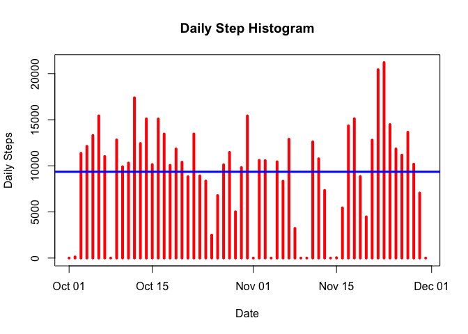
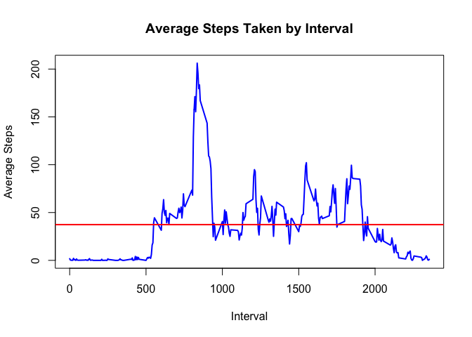
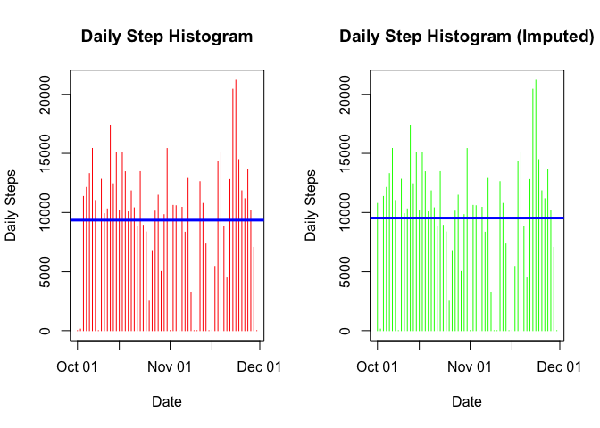
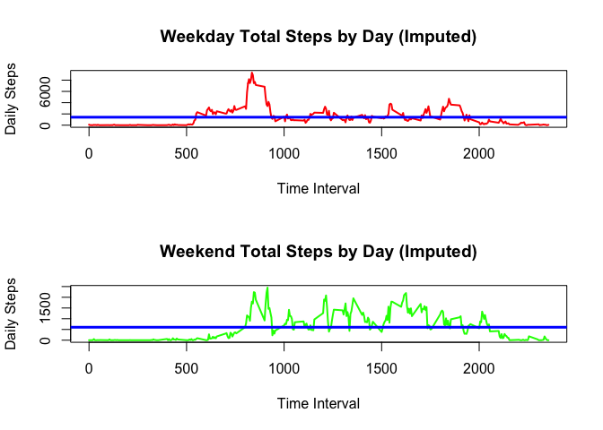

Reading the Data Into an R Object
---------------------------------

We begin by reading the data into the R object `activity`:

    #setwd("~/GitHub/Reproducible_Reserach/Course Project 1")
    activity <- read.table("./data/activity.csv", header = TRUE, sep = ",", na.strings = "NA")
    activity$date <- as.Date(activity$date)

Let's take a look at the first few elements of `activity`:

    head(activity)

    ##   steps       date interval
    ## 1    NA 2012-10-01        0
    ## 2    NA 2012-10-01        5
    ## 3    NA 2012-10-01       10
    ## 4    NA 2012-10-01       15
    ## 5    NA 2012-10-01       20
    ## 6    NA 2012-10-01       25

We can already see there are a number of missing values for `steps`.
Let's get a bit more information on `activity`:

    str(activity)

    ## 'data.frame':    17568 obs. of  3 variables:
    ##  $ steps   : int  NA NA NA NA NA NA NA NA NA NA ...
    ##  $ date    : Date, format: "2012-10-01" "2012-10-01" ...
    ##  $ interval: int  0 5 10 15 20 25 30 35 40 45 ...

This is a data frame object with 17,568 observations. It is
disconcerting that there are so many missing values. What percentage of
the values are missing?

    mean(is.na(activity))

    ## [1] 0.04371585

It appears that roughly 4.37% of the observations are missing steps
data. For now we won't be concerned with this but it's nice to have that
knowledge handy. Finally, here's a summary of the data in `activity`:

    summary(activity, na.rm = TRUE)

    ##      steps             date               interval     
    ##  Min.   :  0.00   Min.   :2012-10-01   Min.   :   0.0  
    ##  1st Qu.:  0.00   1st Qu.:2012-10-16   1st Qu.: 588.8  
    ##  Median :  0.00   Median :2012-10-31   Median :1177.5  
    ##  Mean   : 37.38   Mean   :2012-10-31   Mean   :1177.5  
    ##  3rd Qu.: 12.00   3rd Qu.:2012-11-15   3rd Qu.:1766.2  
    ##  Max.   :806.00   Max.   :2012-11-30   Max.   :2355.0  
    ##  NA's   :2304

The above summary suggests the overall mean number of steps is 37.38.
That seems very low and worth exploring further. Let's summarize the
data by days and find the mean number of steps taken by day.

What is the mean total number of steps taken per day?
-----------------------------------------------------

    dailysumm <- summarize(group_by(activity, date), total.steps = sum(steps, na.rm = TRUE), mean.steps = mean(steps, na.rm = TRUE))

    plot(dailysumm$date, dailysumm$total.steps, type = "h", lwd = 4, col = "red", main = "Daily Step Histogram", xlab = "Date", ylab = "Daily Steps")

    abline(h = mean(dailysumm$total.steps, rm.na = TRUE), lwd = 3, col = "blue")

From the histrogram we can see there are a total of ten days with zero
steps recorded. Looking at a summary of our data table we see the
following:

    summary(dailysumm)

    ##       date             total.steps      mean.steps     
    ##  Min.   :2012-10-01   Min.   :    0   Min.   : 0.1424  
    ##  1st Qu.:2012-10-16   1st Qu.: 6778   1st Qu.:30.6979  
    ##  Median :2012-10-31   Median :10395   Median :37.3785  
    ##  Mean   :2012-10-31   Mean   : 9354   Mean   :37.3826  
    ##  3rd Qu.:2012-11-15   3rd Qu.:12811   3rd Qu.:46.1597  
    ##  Max.   :2012-11-30   Max.   :21194   Max.   :73.5903  
    ##                                       NA's   :8

The median steps taken on a daily basis is **10,395** while the mean
steps taken on a daily basis is **9,354**.

What is the average daily activity pattern?
-------------------------------------------

We'll make use of `dplyr` again but this time to look at the 5-minute
interval information.

    fiveminsumm <- summarize(group_by(activity, interval), total.steps = sum(steps, na.rm = TRUE), mean.steps = mean(steps, na.rm = TRUE))
    plot(fiveminsumm$interval, fiveminsumm$mean.steps, type = "l", lwd=2, col = "blue", main = "Average Steps Taken by Interval", xlab = "Interval", ylab = "Average Steps")
    abline(h = mean(fiveminsumm$mean.steps, na.rm = TRUE), lwd = 2, col = "red")

Based on what we're seeing, the time interval with the maximum average
steps is in between 500 and 1,000. Specifically, we see it's interval:

    paste("Interval with maxiumum value is", fiveminsumm$interval[which(fiveminsumm$mean.steps == max(fiveminsumm$mean.steps))])

    ## [1] "Interval with maxiumum value is 835"

And the maximum value of these steps is:

    max(fiveminsumm$mean.steps)

    ## [1] 206.1698

Imputing missing values
-----------------------

As observed above, 4.37% of the data are missing values.

    paste("There are", sum(is.na(activity$steps)), "observations with missing values.")

    ## [1] "There are 2304 observations with missing values."

In the `fiveminsumm` dataset, we already calculated the average of the
5-minute interval across all 61 days with the `NA` values removed. We
can now use that to easily impute the missing values into a new R
object.

    naList <- which(is.na(activity$steps))
    activity_imputed <- activity
    activity_imputed[naList,"steps"] <- fiveminsumm[naList,"mean.steps"]

Let's take a look at the impact of imputing these values. Since we are
filling in the values with the means we don't need to worry about
ranges. These won't be impacted. We can view the graphs side-by-side and
make comparisons by eyeballing.

    dailysumm_imp <- summarize(group_by(activity_imputed, date), total.steps = sum(steps, na.rm = TRUE), mean.steps = mean(steps, na.rm = TRUE))
    par(layout(matrix(c(1,2), nrow = 1, ncol = 2)))

    ## NULL

    plot(dailysumm$date, dailysumm$total.steps, type = "h", lwd = 1, col = "red", main = "Daily Step Histogram", xlab = "Date", ylab = "Daily Steps")

    abline(h = mean(dailysumm$total.steps, rm.na = TRUE), lwd = 3, col = "blue")

    plot(dailysumm_imp$date, dailysumm_imp$total.steps, type = "h", lwd = 1, col = "green", main = "Daily Step Histogram (Imputed)", xlab = "Date", ylab = "Daily Steps")

    abline(h = mean(dailysumm_imp$total.steps, rm.na = TRUE), lwd = 3, col = "blue")

Let's look at a summary of these two values.

    summary(dailysumm)

    ##       date             total.steps      mean.steps     
    ##  Min.   :2012-10-01   Min.   :    0   Min.   : 0.1424  
    ##  1st Qu.:2012-10-16   1st Qu.: 6778   1st Qu.:30.6979  
    ##  Median :2012-10-31   Median :10395   Median :37.3785  
    ##  Mean   :2012-10-31   Mean   : 9354   Mean   :37.3826  
    ##  3rd Qu.:2012-11-15   3rd Qu.:12811   3rd Qu.:46.1597  
    ##  Max.   :2012-11-30   Max.   :21194   Max.   :73.5903  
    ##                                       NA's   :8

    summary(dailysumm_imp)

    ##       date             total.steps      mean.steps     
    ##  Min.   :2012-10-01   Min.   :    0   Min.   : 0.1424  
    ##  1st Qu.:2012-10-16   1st Qu.: 7047   1st Qu.:30.7648  
    ##  Median :2012-10-31   Median :10439   Median :37.3805  
    ##  Mean   :2012-10-31   Mean   : 9531   Mean   :37.3826  
    ##  3rd Qu.:2012-11-15   3rd Qu.:12811   3rd Qu.:45.8030  
    ##  Max.   :2012-11-30   Max.   :21194   Max.   :73.5903  
    ##                                       NA's   :7

You can see mean and median steps reported above. What we see is there
has been a modest shift upward in both the mean and median values of the
total daily steps as a result of imputing the missing values.

Are there differences in activity patterns between weekdays and wekends?
------------------------------------------------------------------------

For this section we will be using the imputed data but we'll be
appending the weekday information.

    activity_imputed <- mutate(activity_imputed, weekday = weekdays(date))
    activity_imputed$weekday <- as.factor(activity_imputed$weekday)
    weekend <- filter(activity_imputed, weekday == "Saturday" | weekday == "Sunday" )
    weekday <- filter(activity_imputed, weekday == "Monday" | weekday == "Tuesday" | weekday == "Wednesday" | weekday == "Thursday" | weekday == "Friday")

Lastly, let's plot the two imputed vectors against the time intervals to
see what we get.

    fms_weekday <- summarize(group_by(weekday, interval), total.steps = sum(steps, na.rm = TRUE), mean.steps = mean(steps, na.rm = TRUE))
    fms_weekend <- summarize(group_by(weekend, interval), total.steps = sum(steps, na.rm = TRUE), mean.steps = mean(steps, na.rm = TRUE))
    par(mfcol = c(2,1))
    plot(fms_weekday$interval, fms_weekday$total.steps, type = "l", lwd = 2, col = "red", main = "Weekday Total Steps by Day (Imputed)", xlab = "Time Interval", ylab = "Daily Steps")
    abline(h = mean(fms_weekday$total.steps, rm.na = TRUE), lwd = 3, col = "blue")

    plot(fms_weekend$interval, fms_weekend$total.steps, type = "l", lwd = 2, col = "green", main = "Weekend Total Steps by Day (Imputed)", xlab = "Time Interval", ylab = "Daily Steps")
    abline(h = mean(fms_weekend$total.steps, rm.na = TRUE), lwd = 3, col = "blue")

It definitely looks like there are many more steps taken over the
weekend versus the weekday.
